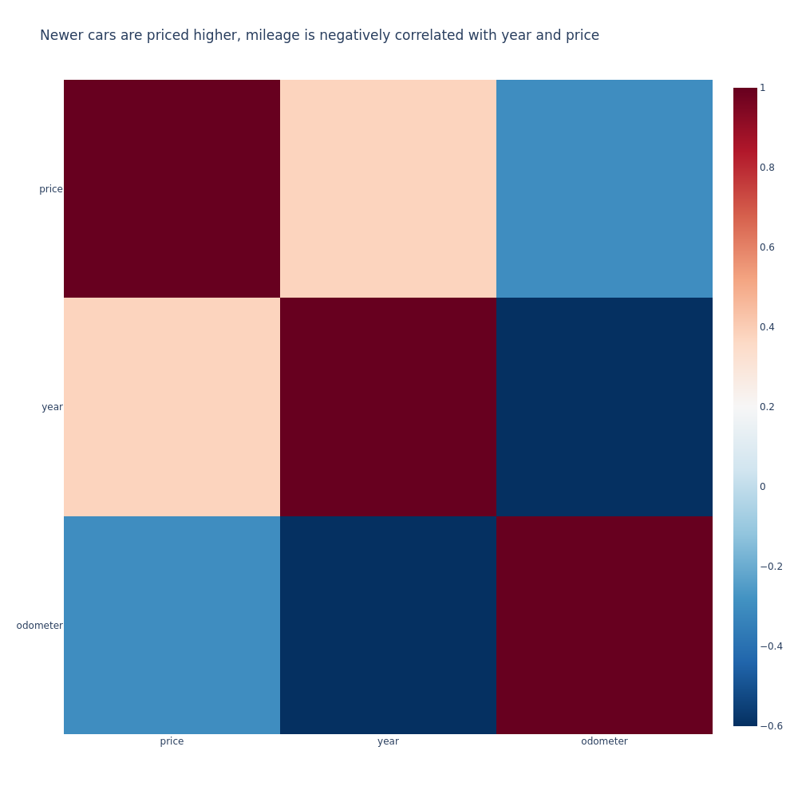
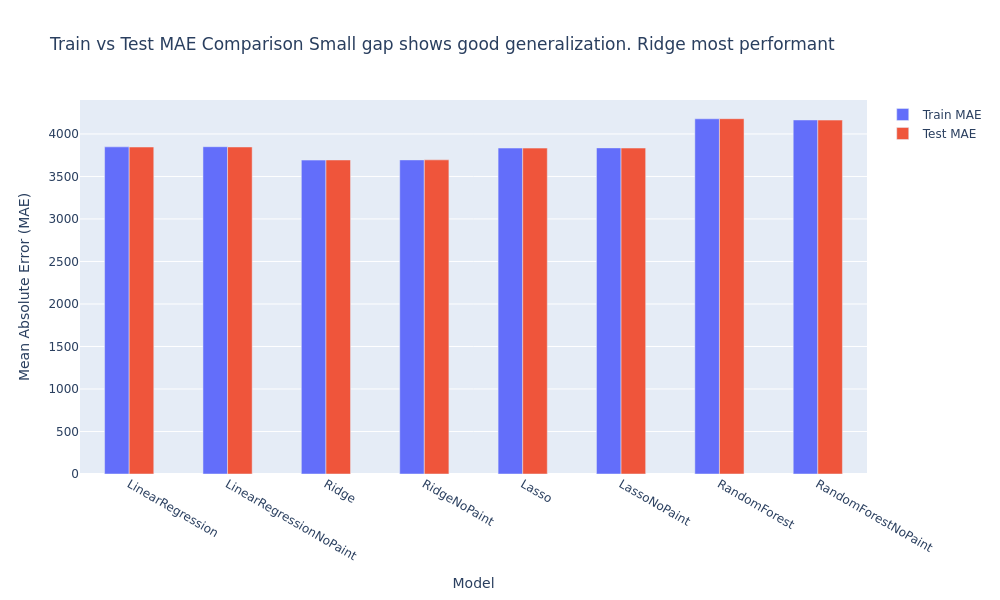
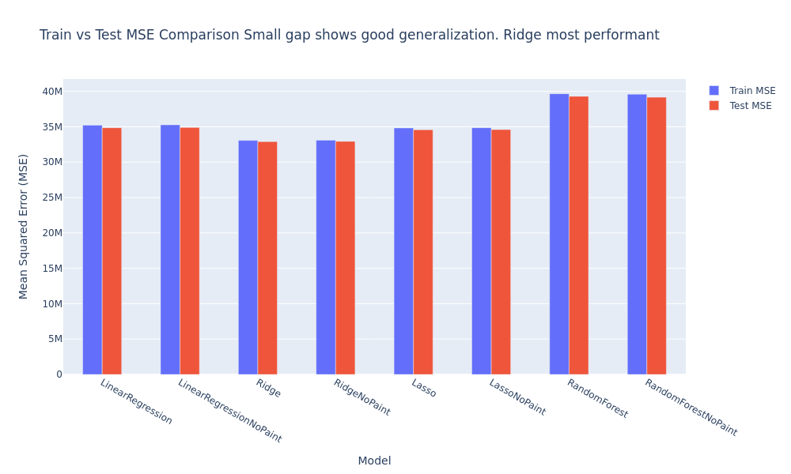
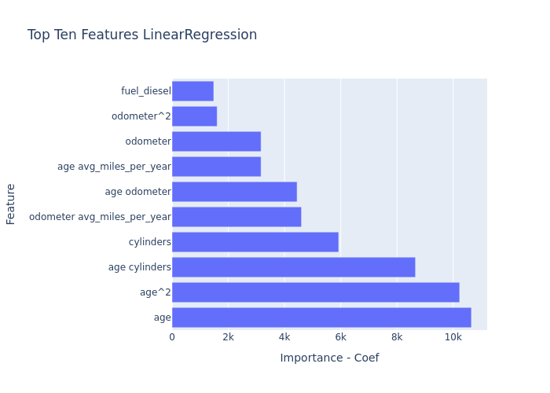
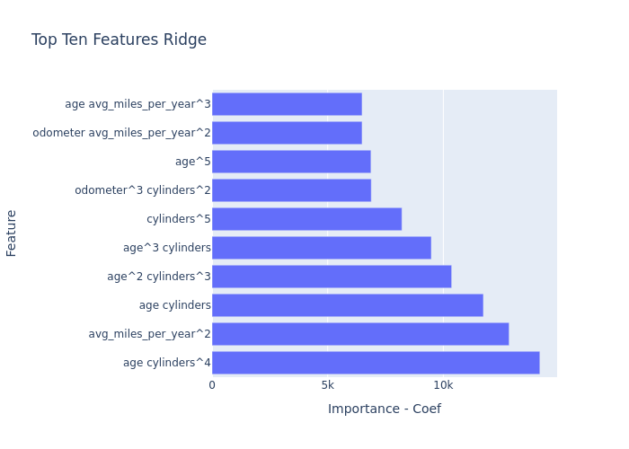
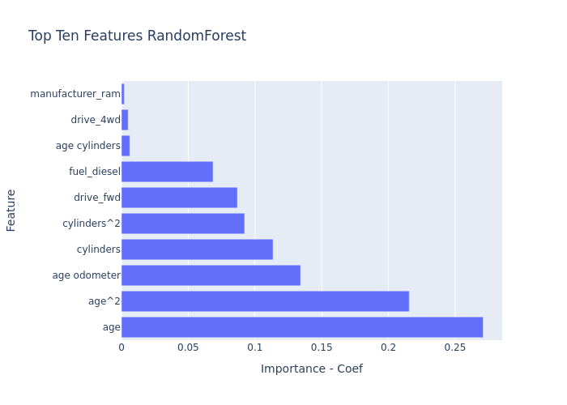

# UsedCarsAnalysis

A repository focused on assessing the features that drive the price of a car and what consumers value in a used car

## Link to notebook

[Primary Notebook](https://github.com/mattdabit/UsedCarsAnalysis/blob/main/prompt_II.ipynb)

## Local Installation

1. Clone the repository
2. Use a python environment manager. I prefer conda.
3. Create and activate conda environment
    ```
    conda env create -f environment.yml   
    conda activate ml_env
    ```

## About the Dataset

This dataset is a subset of a larger dataset on Kaggle. It contains information on used vehicle sales with properties
ranging from the purchase price, the title status and the manufacturer. The dataset contains over 400k rows. This
dataset is missing values. However, we are missing values, specifically the condition and cylinders attributes are
missing in over 40% of rows. Color is missing in 31% of rows. Size is missing in 72% of rows. Drive is missing in
31% of rows. These attributes are important in determining the price of a car from prior analysis.
The amount of missing data is concerning and the best course of action may be to impute them. That may mislead our
model and we should be wary of that. However, dropping over 40% of the data isn't something we should do. It is
important to call out that the most recently sold vehicle in this dataset is a 2022 model, meaning models we build we
suffer from significant data drift.

## Understanding the business

Our stakeholders are seeking to understand what factors drive the price of a used vehicle. Reading between the lines one
can infer that their goal is to improve their sales, margins and meet market demand. They have provided as a dataset of
used vehicle sales and have asked us to determine which factors make a vehicle more or less expensive. A
recent [report](https://www.statista.com/statistics/183713/value-of-us-passenger-cas-sales-and-leases-since-1990/) shows
that used vehicle sales doubles the amount of new vehicle sales. The used vehicle market is lucrative with high demand
from consumers. Our stakeholders want to stay ahead of the curve and understanding their customer's preferences can help
lead to more sales. Used vehicle dealerships also have to acquire vehicles for inventory from other entities. If our
stakeholder can reasonably determine the cost of a used vehicle, they can better understand their margins and when to
purchase a vehicle for inventory. It is also important to understand what customers value in used vehicles. Knowing what
drives a consumer to purchase a used vehicle can help our stakeholders avoid costly mistakes when acquiring inventory.

## Understanding the data

### Anomalies in the data


We see in the above images some vehicles were sold for over a billion dollars. Unless our dealership is selling used
rockets, this is almost certainly a mistake. We also see a good chunk of vintage vehicles sold. The vintage market
behaves quite differently than the average market so I will remove those entries as well. Before that we will impute
our missing data.

### Imputation Results

I imputed the data by grouping the dataset by model and year. Then for fields I wanted to impute, I iterated over all
rows missing data and found the mode of their model and year. I could have used a SimpleImputer from scipy but I believe
that would have been too simple. I think the K-nearest Neighbor Imputer would have done a nice job as well but I am glad
that I took the time to build my own imputation method. I decided to save the
[imputed dataset](https://github.com/mattdabit/UsedCarsAnalysis/blob/main/data/imputed_vehicles.csv) to avoid re-running
the long process over and over.
The imputed vehicle data is looking a lot better.
<table>
<tr>
<th>column</th>
<th>old missing value percent</th>
<th>new missing value percent</th>
</tr>
<tr>
<td>condition</td>
<td>0.41</td>
<td>0.09</td>
</tr>
<tr>
<td>condition</td>
<td>0.42</td>
<td>0.14</td>
</tr>
<tr>
<td>drive</td>
<td>0.31</td>
<td>0.10</td>
</tr>
<tr>
<td>size</td>
<td>0.72</td>
<td>0.30</td>
</tr>
<tr>
<td>type</td>
<td>0.22</td>
<td>0.05</td>
</tr>
<tr>
<td>paint_color</td>
<td>0.31</td>
<td>0.08</td>
</tr>
</table>

### Data loss summary

After removing outliers & dropping rows with NAs the non-imputed dataset contains 33,728 rows and the imputed set
contains 148,360.
This is out of the original 426,880 rows.
This is roughly 35% of the original data. As we can see, without imputation we would have lost the majority of the
dataset.

### Univariate and Multivariate Analysis

#### Price Univariate Analysis


A majority of used vehicles are purchased at a price point between \$6,500–\$21,990. The histogram also indicates this.

#### Year Univariate Analysis


 When people are looking to purchase a used vehicle they prefer to purchase them on the newer side. 

#### Analysis of Imputation effect: Comparing our Non Imputed Data with the Imputed data


Imputation had some effect on our data.
In the majority of cases our imputation followed the already present trends.
However, for condition and vehicle type we
saw that the imputation shuffled around the most popular values.
This indicates that the result of imputation did not
drastically change the nature of the data.

#### Popularity analysis


The above is an analysis of the popularity of non-imputed fields. The prior section has the popularity trends of the
imputed
fields. The first thing I noticed after this analysis was that the region, model and state attributes should be
represented differently. We also gained insight into which features were most popular in sold used vehicles.

#### Popularity versus Price analysis


 In the above comparison, we see that price isn't the sole factor when it comes to a purchase. In the end, the customer
needs to like the vehicle. We see that full size vehicles are not only the most popular but also the most expensive. 
Additionally, we see that the top four vehicle types range from the least expensive type to the most expensive type.
This tells us the consumer is willing to spend more to get what they want. 

#### State and Region analysis


The above is a representation of the total volume and average prices across the states and regions in the dataset.
The first image is without imputation, the second is with imputation.
The graphs are better explored in the notebook, however,
we can still see that California has the highest volume, yet does not have the highest average sales price.
This was an
interesting find for me.
Maybe, if we included vintage cars, this map would look different. With the treemaps we see that the most populated
states have the highest volume. However, other states have a higher price average. This could be indicative of
different needs in different regions.

#### Manufacturer analysis


In the above graphs, we see the average price for a manufacturer. The imputed dataset on the bottom and the non-imputed
dataset on top. The big call-out here is that the least expensive vehicles are not the most popular. This would indicate
that there may be some brand loyalty, or other factors such as reliability driving consumer decisions. I also noticed
here that Ferrari was missing price data here.

After this analysis, I have seen enough to conclude that our imputed data set is good to work with moving forward.

#### Correlation Matrix



In the correlation matrix, we can see that newer cars are priced higher. Meaning age is negatively correlated with
price.
We also see that mileage is negatively correlated with age and therefore prices. This all makes intuitive sense. Older
vehicles are less expensive because of mileage, and mileage is high because the vehicle is older.

## Data Preparation

### Cleaning and imputation

I used the IQR method to remove outliers on price. Additionally, I saw quite a few rows with a price of 0, I removed
those as well. In this section, I noticed some peculiar trends with low prices. I believe our stakeholder provided a
dataset with used parts sales. I will need to speak with the stakeholders to see how we can eliminate that data to
improve our predicting power. I also removed cars older than 1995, this is because I did not want to mix vintage sales
with modern day vehicle sales. I chose 1995 based on our year analysis above. I recycled the imputation process I did
in the data understanding phase. I dropped id, VIN and region from the dataset. I also dropped fields with NA and
duplicates. As you will see below, I added new features and decided to analyze those features.

### Feature Engineering Analysis

#### Introduction of new features

At this point the correlation matrix gave me the idea to add a new feature. The two features were age and average miles
per year. These new feature should better represent the correlation between mileage, age and price. Later we will see
that these features were the most important features for our models.

#### Correlation Matrix


Suprisingly, average miles per year show no correlation with price. This would indicate a non-linear relationship. This 
was an interesting find to me. What is not surprising is that our new features are highly correlated with the features 
they were derived from.

#### Average Miles Per Year Analysis


In the above graphs we see that most vehicles are adding 5,000 to 10,000 miles per year. We did find some crazy outliers
to be cautious about. But this can all be attributed to what that vehicle is used for. For example, a 16-wheeler is
driven consistently and a large mileage per year would not be surprising.

#### Age versus Average Price


The above graph demonstrates our correlation assessment. Older cars are less expensive.

#### PCA analysis


Our scree plot shows that we may be able to collapse our numerical features into one. I was not too confident in that
given the lack of numerical features.

### Selecting our features

I split our features into categorical and numerical features. Our numerical features included age, odometer and average
miles per year. The rest of our columns were categorical. I also decided to use ordinal encoding for title status and
condition as these features follow a natural order.

### Defining our transformers

I added four different transformers here. A polynomial transformer, two ordinal transformers and
one hot encoder transformer.

## Modeling

I used four different types of models, LinearRegression, Ridge, Lasso and RandomForestRegressor. All four of these types
went through grid search cross-validation with various hyperparameters for each respective model. I used a test set of
20% and price was my target variable. Before fitting the models I also defined a `eval_model` function to gather the
mean absolute error (MAE), mean squared error (MSE) and root mean squared error (RMSE) for the test and train sets. The
method also extracts the best parameters and coefficients for applicable models. All models excluding the RandomForest
model used a standard scaler for preprocessing the numerical variables. From prior readings RandomForest does not
benefit
from scaling numerical columns.
Here are the hyperparameters for each model type.

**LinearRegression - 5 folds**

```aiignore
param_grid = {
    "preprocessor__poly__degree": [2, 3, 4, 5, 6],
}
```

**Ridge - 5 folds**

```aiignore
param_grid = {
    "preprocessor__poly__degree": [2, 3, 4, 5, 6],
    "Ridge__alpha": [0.01, 0.1, 1, 10, 100],
}
```

**Lasso - 3 folds**

```aiignore
param_grid = {
    "preprocessor__poly__degree": [2, 3, 4],
    "Lasso__alpha": [1.0, 5, 10, 50, 100],
}
```

**RandomForestRegressor - 3 folds**

```aiignore
param_grid = {
    "preprocessor__poly__degree": [2, 3, 4],
    "RandomForest__max_depth": [4, 5],
    "RandomForest__n_estimators": [100, 200],
}
```

I reduced the folds and polynomial degree for Lasso and RandomForest because of computation. I used different alphas for
the Lasso model because I was seeing a ConvergenceWarning. After some research, I decided to lower the tolerance and
increase the maximum iterations for the Lasso model.

I trained these models twice, once without the paint feature and once with it. I saw something interesting in the paint
color coefficient and wanted to see if it was affecting predicting power. Considering that we will see that the Lasso
model performed best, I may have been on to something.

## Evaluation of models

Utilizing my `eval_model` method, I collected the metrics from all models and stored them in a dataframe for evaluation.

### Metrics Comparison




In the above graphs we see that the Lasso model performed the best. The gaps between the train and test sets are small
which indicates good generalization for our models. This is a common trend in all metrics.

### Feature Importance

For all models excluding the RandomForest model, we had to derive the most important features from the model's
coefficients. In these sets of models, the larger the coefficient, the larger the impact on the model. I defined a
function `get_feature_names` to help associated the features with the coefficients. I think zipped the name of the
features and its corresponding coefficient into dataframes. The random forest model comes with a `feature_importances_`
property. With all the feature importances gather we can rank sort them and see what features helps our model predict
price.

#### LinearRegression, Ridge, Lasso and RandomForest






We see that age, odometer and average miles per year were all top features for all models in various
polynomial representations. It's interesting that both the linear regression and random forest models
identified the cylinders feature as significant, especially since neither model beat out ridge and lasso,
yet they reached similar conclusions.

### Model Iteration

All the following metrics are stored in the
[scores dataframe csv](https://github.com/mattdabit/UsedCarsAnalysis/blob/main/data/scores_df.csv)
and [scores no zeros dataframe csv](https://github.com/mattdabit/UsedCarsAnalysis/blob/main/data/scores_no_zeros_df.csv).
In this section, I will speak to my thought process when it came to fitting my models and how I arrived at the best
ones.

#### Model Iteration 1

The ridge model performed the best in this iteration.
The error felt too high to me, so I wanted to continue to fiddle with the features.

#### Model Iteration 1 result

In my first iteration, I saw that paint color was affecting price.
This didn't feel correct, so in the next iteration I removed paint color as a feature.

#### Model Iteration 2

I refitted the models, this time without paint color.

#### Model Iteration 2 Result

After testing, removing paint made our models worse! This was not what I thought would happen.

#### Model Iteration 3

I took a second pass and saw that I included items at 0 dollars in my dataset.
I removed these and refitted the models.

#### Model Iteration 3 Result

The scores are far better now. Our test metrics dropped about 2000 dollars.

#### Model Comparison Iteration 1 & 2

<table>
  <thead>
    <tr>
      <th>model_name</th>
      <th>train_mae</th>
      <th>test_mae</th>
      <th>train_mse</th>
      <th>test_mse</th>
      <th>train_rmse</th>
      <th>test_rmse</th>
      <th>best_params</th>
    </tr>
  </thead>
  <tbody>
    <tr>
      <td>LinearRegression</td>
      <td>5283.77</td>
      <td>5294.00</td>
      <td>64031541.68</td>
      <td>64194335.93</td>
      <td>8001.97</td>
      <td>8012.14</td>
      <td>{'preprocessor__poly__degree': 2}</td>
    </tr>
    <tr>
      <td>LinearRegressionNoPaint</td>
      <td>5285.40</td>
      <td>5296.52</td>
      <td>64098638.01</td>
      <td>64269098.87</td>
      <td>8006.16</td>
      <td>8016.80</td>
      <td>{'preprocessor__poly__degree': 2}</td>
    </tr>
    <tr>
      <td>Ridge</td>
      <td>5225.62</td>
      <td>5229.38</td>
      <td>63065606.60</td>
      <td>63064394.53</td>
      <td>7941.39</td>
      <td>7941.31</td>
      <td>{'Ridge__alpha': 0.01, 'preprocessor__poly__degree': 6}</td>
    </tr>
    <tr>
      <td>RidgeNoPaint</td>
      <td>5226.53</td>
      <td>5231.90</td>
      <td>63124370.98</td>
      <td>63128494.09</td>
      <td>7945.08</td>
      <td>7945.34</td>
      <td>{'RidgeNoPaint__alpha': 0.01, 'preprocessor__poly__degree': 6}</td>
    </tr>
    <tr>
      <td>Lasso</td>
      <td>5257.35</td>
      <td>5265.29</td>
      <td>63636373.78</td>
      <td>63650075.25</td>
      <td>7977.24</td>
      <td>7978.10</td>
      <td>{'Lasso__alpha': 1.0, 'preprocessor__poly__degree': 3}</td>
    </tr>
    <tr>
      <td>LassoNoPaint</td>
      <td>5258.66</td>
      <td>5267.62</td>
      <td>63700182.15</td>
      <td>63720917.01</td>
      <td>7981.24</td>
      <td>7982.54</td>
      <td>{'LassoNoPaint__alpha': 1.0, 'preprocessor__poly__degree': 3}</td>
    </tr>
    <tr>
      <td>RandomForest</td>
      <td>5418.38</td>
      <td>5457.99</td>
      <td>67308779.78</td>
      <td>67985841.22</td>
      <td>8204.19</td>
      <td>8245.35</td>
      <td>{'RandomForest__max_depth': 5, 'RandomForest__n_estimators': 100, 'preprocessor__poly__degree': 4}</td>
    </tr>
    <tr>
      <td>RandomForestNoPaint</td>
      <td>5417.84</td>
      <td>5458.16</td>
      <td>67338583.29</td>
      <td>68029615.54</td>
      <td>8206.01</td>
      <td>8248.01</td>
      <td>{'RandomForestNoPaint__max_depth': 5, 'RandomForestNoPaint__n_estimators': 200, 'preprocessor__poly__degree': 4}</td>
    </tr>
  </tbody>
</table>

<p>
After a thorough analysis of four different model types, the Ridge model stands out as the best.
The Ridge model achieved a Mean Absolute Error of 5,229.38,
a Mean Squared Error of 63,064,394.53 and a Root Square Error of 7,941.31 on the test set.
The RMSE metric would be the best to select to explain our model.
We would tell our stakeholder that our model can be off by $7,941.31 when predicting prices.
The best parameters identified through cross-validation were an alpha of 0.01 and a polynomial degree of 6.
Suggesting that a lower regularization effect was more effective.
Interestingly, Lasso's best alpha was 1, indicating regularization was beneficial for Lasso.
Removing the paint color from the models actually had a slight detrimental effect,
so it would be best to keep this feature.
In terms of feature importance, the top features across all models were polynomial representations of age,
average miles per year and odometer readings.
This indicates that our feature engineering was successful and as expected from our multivariate analysis,
mileage and age significantly influence the price.
Additionally, our analysis revealed that Ford, Chevy and Toyota were the most popular manufacturers.
The univariate analysis showed
that vehicles in excellent and good condition were most common with average prices falling in the middle.
Vehicle type analysis showed interesting trends.
Sedans, SUVs and trucks were the most popular but had distinct average price points.
When reporting to the business we will present the Ridge model
and talk about the features that were most influential and most popular.
We will discus how the most important features affect the price of a vehicle.
</p>

#### Model Comparison Iteration 3

<table>
  <thead>
    <tr>
      <th>model_name</th>
      <th>train_mae</th>
      <th>test_mae</th>
      <th>train_mse</th>
      <th>test_mse</th>
      <th>train_rmse</th>
      <th>test_rmse</th>
      <th>best_params</th>
    </tr>
  </thead>
  <tbody>
    <tr>
      <td>LinearRegression</td>
      <td>4147.62</td>
      <td>4192.61</td>
      <td>37984398.81</td>
      <td>38414125.94</td>
      <td>6163.15</td>
      <td>6197.91</td>
      <td>{'preprocessor__poly__degree': 2}</td>
    </tr>
    <tr>
      <td>Ridge</td>
      <td>4096.24</td>
      <td>4140.08</td>
      <td>37080647.82/td>
      <td>37469295.35</td>
      <td>6089.39</td>
      <td>6121.21</td>
      <td>{'Ridge__alpha': 100, 'preprocessor__poly__degree': 4}</td>
    </tr>
    <tr>
      <td>Lasso</td>
      <td>4094.92</td>
      <td>4139.33</td>
      <td>37067304.46</td>
      <td>37466941.96</td>
      <td>6088.29</td>
      <td>6121.02</td>
      <td>{'Lasso__alpha': 1.0, 'preprocessor__poly__degree': 4}</td>
    </tr>
    <tr>
      <td>RandomForest</td>
      <td>4262.12</td>
      <td>4285.24</td>
      <td>40738091.59/td>
      <td>40839139.22</td>
      <td>6382.64</td>
      <td>6390.55</td>
      <td>{'RandomForest__max_depth': 5, 'RandomForest__n_estimators': 100, 'preprocessor__poly__degree': 2}</td>
    </tr>
  </tbody>
</table>

<p>
We vastly improved our models in iteration 3. The only change here was removing items with a price of 0.
Our clients are likely not giving away things for free.
It also seems that within this dataset our clients are selling used parts.
These parts and their prices are included in the dataset.
This is definitely having an effect on the predicting power of our models.
The next course of action would be to remove these line items from the dataset.
I do see that there is a parts_only type in the dataset however I am not confident that I could just remove that.
I will need to reach out to the stakeholder to determine if they can curate a dataset with only used vehicles.
If that is not possible I will ask them
to help me determine which features I can used to remove line items that do not accurately represent used vehicles.
The Lasso model became our best model in terms of metrics, beating Ridge by 19 cents.
With an RMSE of 6121.02 we can confidently recommend the Lasso model over the others.
</p>

## Deployment / Business Report

## Key features that drive the price of a car

In the below image you will see the most important factors for the best performing price-predicting model. Across all
models, the age, mileage and average miles per year had an enormous effect on determining price.


We also see in this graph that as cars age, the price decreases.


This does not mean that price is the only determinant for whether a customer will purchase a used vehicle.
When we compare the following graphs we will see that sometimes what is popular may not be the least expensive option.
For example, when it comes to vehicle size, the most expensive option (full-size) is also the most popular. Trucks and
pickups are 3rd and 4th popularity and are in the top 3 of most expensive types of vehicles.


When it comes to manufacturers, we also see different trends. The most popular car brand we see is Ford.


As we see in the above graph, Ford is not the least expensive option.

Another facet to look at is where your customers live. California buyers have different tendencies than North Carolina
buyers and so forth.


As we see in the above graph, California may have had the highest volume of sales, but the average purchase price was
far below North Carolina's average purchase price.

My recommendation to the stakeholders would be to look at what manufacturers, vehicle types are most popular. In the
case of this dataset, that would be Ford, Chevrolet and Toyota for manufacturers and Sedans, SUVs and Trucks/Pickups for
vehicle types. I would also recommend to our stakeholders to stock recent models in good to excellent condition,
additionally, a clean title is always preferred. Lastly, the age and mileage of the vehicle is important when it comes
to sales price. Age and mileage are positively correlated, meaning as a car gets older, the more miles on the odometer,
as more miles accrue, the price drops.

All this said, the customer needs to like the vehicle if you want to land that sale. Yes, we can focus on what is
popular and that would satisfy the vast majority of customers. However, the stakeholders will miss out on connoisseurs
who are willing to pay a premium for the vehicle they want. This all depends on how our stakeholders want to run their
business. If they are looking to appease the masses, they should prioritize the trends that I outline above.