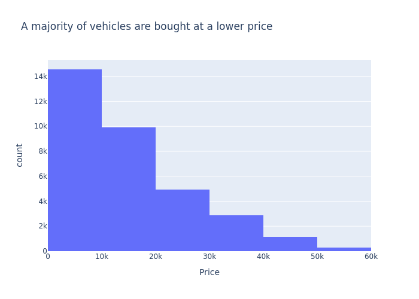

# UsedCarsAnalysis

A repository focused on assessing the features that drive the price of a car and what consumers value in a used car

## Link to primary

[Primary Notebook](https://github.com/mattdabit/UsedCarsAnalysis/blob/main/prompt_II.ipynb)

## Local Installation

1. Clone the repository
2. Use a python environment manager. I prefer conda.
3. Create and activate conda environment
    ```
    conda env create -f environment.yml   
    conda activate ml_env
    ```

## About the Dataset

This dataset is a subset of a larger dataset on Kaggle. It contains information on used vehicle sales with properties
ranging from the purchase price, the title status and the manufacturer. The dataset contains over 400k rows. This
dataset is missing values. However, we are missing values, specifically the condition and cylinders attributes are
missing in over 40% of rows. Color is missing in 31% of rows. Size is missing in 72% of rows. Drive is missing in
31% of rows. These attributes are important in determining the price of a car from prior analysis.
The amount of missing data is concerning and the best course of action may be to impute them. That may mislead our
model and we should be wary of that. However, dropping over 40% of the data isn't something we should do. It is 
important to call out that the most recently sold vehicle in this dataset is a 2022 model, meaning models we build we 
suffer from significant data drift.

## Understanding the business

Our stakeholders are seeking to understand what factors drive the price of a used vehicle. Reading between the lines one 
can infer that their goal is to improve their sales, margins and meet market demand. They have provided as a dataset of 
used vehicle sales and have asked us to determine which factors make a vehicle more or less expensive. A
recent [report](https://www.statista.com/statistics/183713/value-of-us-passenger-cas-sales-and-leases-since-1990/) shows
that used vehicle sales doubles the amount of new vehicle sales. The used vehicle market is lucrative with high demand
from consumers. Our stakeholders want to stay ahead of the curve and understanding their customer's preferences can help
lead to more sales. Used vehicle dealerships also have to acquire vehicles for inventory from other entities. If our
stakeholder can reasonably determine the cost of a used vehicle, they can better understand their margins and when to
purchase a vehicle for inventory. It is also important to understand what customers value in used vehicles. Knowing what
drives a consumer to purchase a used vehicle can help our stakeholders avoid costly mistakes when acquiring inventory.

## Understanding the data
### Anomalies in the data


We see in the above images some vehicles were sold for over a billion dollars. Unless our dealership is selling used
rockets, this is almost certainly a mistake. We also see a good chunk of vintage vehicles sold. The vintage market
behaves quite differently than the average market so I will remove those entries as well. Before that we will impute
our missing data.

### Imputation Results

I imputed the data by grouping the dataset by model and year. Then for fields I wanted to impute, I iterated over all
rows missing data and found the mode of their model and year. I could have used a SimpleImputer from scipy but I believe
that would have been too simple. I think the K-nearest Neighbor Imputer would have done a nice job as well but I am glad
that I took the time to build my own imputation method. I decided to save the imputed dataset to avoid re-running the
long
process over and over.
The imputed vehicle data is looking a lot better.
<table>
<tr>
<th>column</th>
<th>old missing value percent</th>
<th>new missing value percent</th>
</tr>
<tr>
<td>condition</td>
<td>0.41</td>
<td>0.09</td>
</tr>
<tr>
<td>condition</td>
<td>0.42</td>
<td>0.14</td>
</tr>
<tr>
<td>drive</td>
<td>0.31</td>
<td>0.10</td>
</tr>
<tr>
<td>size</td>
<td>0.72</td>
<td>0.30</td>
</tr>
<tr>
<td>type</td>
<td>0.22</td>
<td>0.05</td>
</tr>
<tr>
<td>paint_color</td>
<td>0.31</td>
<td>0.08</td>
</tr>
</table>

### Data loss summary

After removing outliers & dropping rows with NAs the non-imputed dataset contains 33,728 rows and the imputed set
contains 148,360.
This is out of the original 426,880 rows.
This is roughly 35% of the original data. As we can see, without imputation we would have lost the majority of the
dataset.

### Univariate and Multivariate Analysis 

#### Price Univariate Analysis



A majority of used vehicles are purchased at a price point between \$6,500–\$21,990. The histogram also indicates this. 

#### Year Univariate Analysis

 When people are looking to purchase a used vehicle they prefer to purchase them on the newer side. 

#### Analysis of Imputation effect: Comparing our Non Imputed Data with the Imputed data


Imputation had some effect on our data.
In the majority of cases our imputation followed the already present trends.
However, for condition and vehicle type we
saw that the imputation shuffled around the most popular values.
This indicates that the result of imputation did not 
drastically change the nature of the data.

#### Popularity analysis


The above is an analysis of the popularity of non-imputed fields. The prior section has the popularity trends of the imputed
fields. The first thing I noticed after this analysis was that the region, model and state attributes should be 
represented differently. We also gained insight into which features were most popular in sold used vehicles. 


#### Popularity versus Price analysis

 In the above comparison, we see that price isn't the sole factor when it comes to a purchase. In the end, the customer
needs to like the vehicle. We see that full size vehicles are not only the most popular but also the most expensive. 
Additionally, we see that the top four vehicle types range from the least expensive type to the most expensive type.
This tells us the consumer is willing to spend more to get what they want. 

#### State and Region analysis


The above is a representation of the total volume and average prices across the states and regions in the dataset.
The first image is without imputation, the second is with imputation.
The graphs are better explored in the notebook, however,
we can still see that California has the highest volume, yet does not have the highest average sales price.
This was an
interesting find for me.
Maybe, if we included vintage cars, this map would look different. With the treemaps we see that the most populated 
states have the highest volume. However, other states have a higher price average. This could be indicative of 
different needs in different regions.

#### Manufacturer analysis


In the above graphs, we see the average price for a manufacturer. The imputed dataset on the bottom and the non-imputed 
dataset on top. The big call-out here is that the least expensive vehicles are not the most popular. This would indicate
that there may be some brand loyalty, or other factors such as reliability driving consumer decisions. I also noticed 
here that Ferrari was missing price data here. 


After this analysis, I have seen enough to conclude that our imputed data set is good to work with moving forward.

#### Correlation Matrix


In the correlation matrix, we can see that newer cars are priced higher. Meaning age is negatively correlated with price. 
We also see that mileage is negatively correlated with age and therefore prices. This all makes intuitive sense. Older 
vehicles are less expensive because of mileage, and mileage is high because the vehicle is older. 

## Data Preparation

### Cleaning and imputation
I used the IQR method to remove outliers on price. Additionally, I saw quite a few rows with a price of 0, I removed
those as well. In this section, I noticed some peculiar trends with low prices. I believe our stakeholder provided a 
dataset with used parts sales. I will need to speak with the stakeholders to see how we can eliminate that data to 
improve our predicting power. I also removed cars older than 1995, this is because I did not want to mix vintage sales 
with modern day vehicle sales. I chose 1995 based on our year analysis above. I recycled the imputation process I did 
in the data understanding phase. I dropped id, VIN and region from the dataset. I also dropped fields with NA and 
duplicates. As you will see below, I added new features and decided to analyze those features. 

### Feature Engineering Analysis

#### Introduction of new features
At this point the correlation matrix gave me the idea to add a new feature. The two features were age and average miles 
per year. These new feature should better represent the correlation between mileage, age and price. Later we will see 
that these features were the most important features for our models.


#### Correlation Matrix

Suprisingly, average miles per year show no correlation with price. This would indicate a non-linear relationship. This 
was an interesting find to me. What is not surprising is that our new features are highly correlated with the features 
they were derived from.

#### Average Miles Per Year Analysis


In the above graphs we see that most vehicles are adding 5,000 to 10,000 miles per year. We did find some crazy outliers
to be cautious about. But this can all be attributed to what that vehicle is used for. For example, a 16-wheeler is 
driven consistently and a large mileage per year would not be surprising.

#### Age versus Average Price


The above graph demonstrates our correlation assessment. Older cars are less expensive. 

#### PCA analysis 


Our scree plot shows that we may be able to collapse our numerical features into one. I was not too confident in that 
given the lack of numerical features. 

### Selecting our features
I split our features into categorical and numerical features. Our numerical features included age, odometer and average
miles per year. The rest of our columns were categorical. I also decided to use ordinal encoding for title status and 
condition as these features follow a natural order. 

### Defining our transformers
I added 4 different transformers here. A polynomial transformer, two ordinal transformers and 
one hot encoder transformer.

## Modeling

